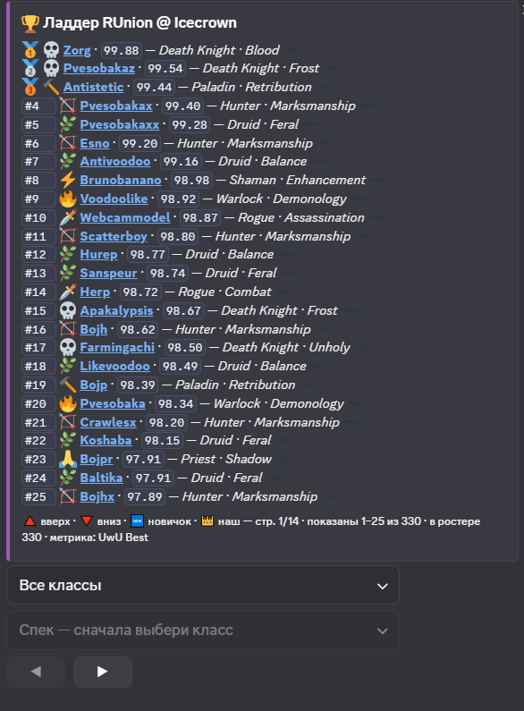
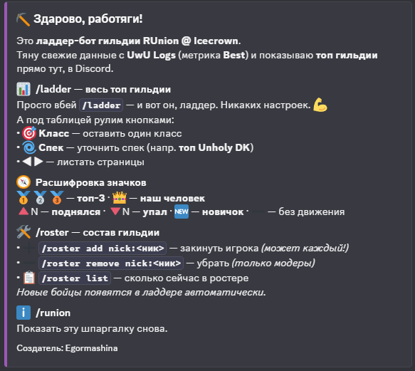

# ⛏️ RUnion Ladder Bot

> Discord-бот, который тянет рейтинги игроков гильдии с **UwU Logs** и строит красивый ладдер прямо в Discord — с фильтрами по классу/спеку, листалкой и трендами позиций.

<p align="left">
  
  
  
  
</p>

Создатель: **Egormashina**

---

## 📸 Скриншоты

### `/ladder` — топ гильдии

Метрика — **UwU «Best»**. Под таблицей кнопки: фильтр по классу, по спеку и листалка страниц. 🥇🥈🥉 — топ-3, 👑 — «наш человек», 🔺/🔻 — изменение позиции, 🆕 — новичок.



### `/runion` — приветствие и справка

Краткая шпаргалка по всем командам и значкам.



---

## ✨ Возможности

- 📊 **Ладдер гильдии** по рейтингу UwU Logs (метрика **Best**), отсортированный от лучших к худшим.
- 🎯 **Интерактивные фильтры** прямо в сообщении: выбор класса, уточнение спека, листание страниц (по 25 строк) — без повторного ввода команды.
- 🏆 **Максимум по спекам:** для каждого игрока проверяются все ДПС-ветки и берётся лучший результат.
- 🩸 **Хибриды учитываются:** Blood DK, Feral Druid и подобные попадают в ладдер; чистые хилы/танки отсеиваются.
- 📈 **Тренды позиций:** бот запоминает прошлые места и показывает, кто поднялся/опустился/новичок.
- 👑 **Именные значки:** особые ники подсвечиваются короной.
- 🗂️ **Управление ростером из Discord:** `/roster add | remove | list`.
- 💾 **Дисковый кеш:** мгновенный вывод ладдера, авто-пересбор по TTL и после правок ростера.
- ⚙️ **Два движка сбора:** `api` (быстрый, рекомендуется) и `browser` (через headless-браузер).

---

## 🚀 Быстрый старт

```bash
# 1. Клонировать
git clone https://github.com/<you>/runion-ladder-bot.git
cd runion-ladder-bot

# 2. Зависимости
pip install -r requirements.txt

# 3. Настроить
cp .env.example .env
#   -> открой .env и впиши DISCORD_TOKEN и DISCORD_GUILD_ID

# 4. Запуск
python -u -B bot.py
```

В консоли должно появиться:

```
RUnion Ladder Bot | 2026-07-04.36-local ... | UWU_MODE=api
Команды синхронизированы для сервера <GUILD_ID>
Вошёл как RUnion bot#1120 (id=...)
```

---

## 🎮 Команды

| Команда | Что делает | Права |
|---|---|---|
| `/ladder` | Показать ладдер гильдии. Фильтры класса/спека и листалка — кнопками под таблицей | все |
| `/runion` | Приветствие + справка по командам и значкам | все |
| `/roster add nick:<ник>` | Добавить игрока в ростер | все |
| `/roster remove nick:<ник>` | Убрать игрока из ростера | модеры / админы (Manage Server) |
| `/roster list` | Сколько сейчас игроков в ростере | все |

### Значки в ладдере

| Значок | Смысл |
|---|---|
| 🥇 🥈 🥉 | Топ-3 гильдии |
| 👑 | «Наш человек» (именной значок) |
| 🔺N | Поднялся на N позиций с прошлого обновления |
| 🔻N | Опустился на N позиций |
| 🆕 | Новичок в ладдере |
| ➖ | Без изменений |

Иконки классов: 💀 DK · 🌿 Druid · 🏹 Hunter · ❄️ Mage · 🔨 Paladin · 🙏 Priest · 🗡️ Rogue · ⚡ Shaman · 🔥 Warlock · ⚔️ Warrior

---

## ⚙️ Настройка (`.env`)

| Переменная | По умолчанию | Описание |
|---|---|---|
| `DISCORD_TOKEN` | — | **Обязательно.** Токен бота из Developer Portal |
| `DISCORD_GUILD_ID` | — | ID сервера для мгновенной регистрации команд. Пусто → глобально (до 1 часа) |
| `WARMANE_GUILD` | `RUnion` | Название гильдии |
| `WARMANE_REALM` | `Icecrown` | Реалм |
| `UWU_SERVER` | `Icecrown` | Имя реалма для UwU Logs |
| `UWU_MODE` | `browser` | Движок сбора: `api` (рекомендуется) или `browser` |
| `UWU_SPECS` | `1,2,3` | Какие ветки талантов проверять (берётся лучшая) |
| `LADDER_LIMIT` | `50` | Сколько строк по умолчанию |
| `CACHE_TTL` | `3600` | TTL кеша в секундах (1 час) |
| `UWU_REQUEST_DELAY` | `1.0` | Пауза между запросами к UwU (сек) |
| `UWU_CONCURRENCY` | `2` | Одновременные запросы в `browser`-режиме (держи 1–2) |
| `UWU_API_CONCURRENCY` | `8` | Одновременные запросы в `api`-режиме (потолок сервера — 8) |
| `UWU_PRUNE_ROSTER` | `0` | `1` — авто-удалять из ростера тех, кого не нашли на UwU |

> 💡 Полный список переменных с комментариями — в [`.env.example`](.env.example).

### Ростер

Файл [`roster.txt`](roster.txt) — по одному игроку на строку:

```
Имя | Класс      # класс нужен только для иконки, можно не указывать
Anatolevich | Warrior
Esno | Hunter
```

Строки с `#` и пустые игнорируются. Ростер можно править прямо из Discord через `/roster add | remove`.

---

## ☁️ Хостинг 24/7

Боту нужен **постоянно работающий процесс** (он держит подключение к Discord) и **сохранение `roster.txt`** между перезапусками. Поэтому «спящие» бесплатные тарифы (Render free, Replit free) не подходят.

**Рекомендуется `UWU_MODE=api`** — он лёгкий и не требует браузера.

| Вариант | Плюсы | Минусы |
|---|---|---|
| Свой ПК / Raspberry Pi | бесплатно, полный контроль, диск не сбрасывается | нужен всегда включённый комп |
| Oracle Cloud «Always Free» | реальный VPS (до 4 ядер / 24 ГБ), 24/7 | нужна карта при регистрации |
| Панель Pterodactyl (Wispbyte и т.п.) | залил → запустил, без карты | мало RAM, только `api`-режим |

<details>
<summary><b>Деплой на панель Pterodactyl (Wispbyte)</b></summary>

1. Создай сервер типа **Python** (3.11).
2. **Files** → загрузи и распакуй архив так, чтобы `bot.py` лежал в корне.
3. Правый клик по `bot.py` → **Use on startup**.
4. Если не поставились пакеты — впиши в поле пакетов: `discord.py aiohttp`.
5. **Startup → переменные:** `DISCORD_TOKEN`, `DISCORD_GUILD_ID`, `UWU_MODE=api`.
6. **Start** и смотри консоль.

⚠️ Не распаковывай архив поверх — затрёшь `roster.txt` с добавленными игроками. Обновляй только `.py`.

</details>

---

## 🛠️ Устройство проекта

| Файл | Назначение |
|---|---|
| `bot.py` | Discord-бот: команды, кнопки, эмбеды |
| `ladder.py` | Сборка ладдера, кеш, версия (`APP_VERSION`) |
| `uwu.py` | Запросы к UwU Logs (api / browser), выбор лучшего спека |
| `roster.py` | Чтение/запись ростера |
| `store.py` | Дисковый кеш, история позиций, лучшие спеки |
| `config.py` | Чтение настроек из `.env` |
| `discover.py` | Помощник для поиска API-эндпоинта UwU |
| `test_api.py` | Быстрая проверка API-режима |
| `roster.txt` | Список игроков гильдии |

---

## ❓ Частые вопросы

**`/ladder` показывает старые параметры.** Перезапусти клиент Discord (Ctrl+R) — список команд обновится.

**Ladder долго собирается в первый раз.** Это нормально: идёт полный скан по UwU (~3–4 мин). Дальше отдаётся из кеша мгновенно; пересбор — по TTL (1 ч) и после правок ростера.

**`Expecting value: line 1 column 1` / пустые ответы.** UwU троттлит при высокой нагрузке — не поднимай `UWU_API_CONCURRENCY` выше 8.

**Игрока нет в ладдере.** Проверь ник в `roster.txt` (регистр как на Warmane/UwU) и что у него есть ДПС-логи на UwU.

---

## 📄 Лицензия

MIT — делай что хочешь, но упоминай автора.

Создатель: **Egormashina**
